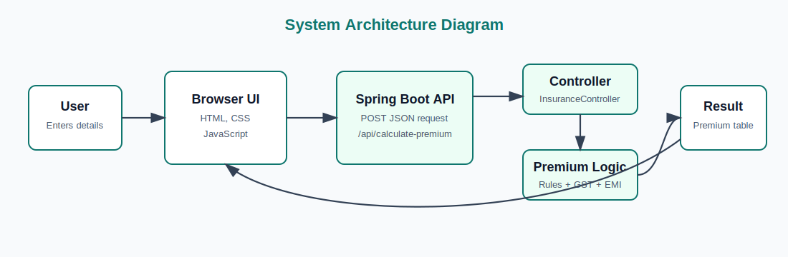
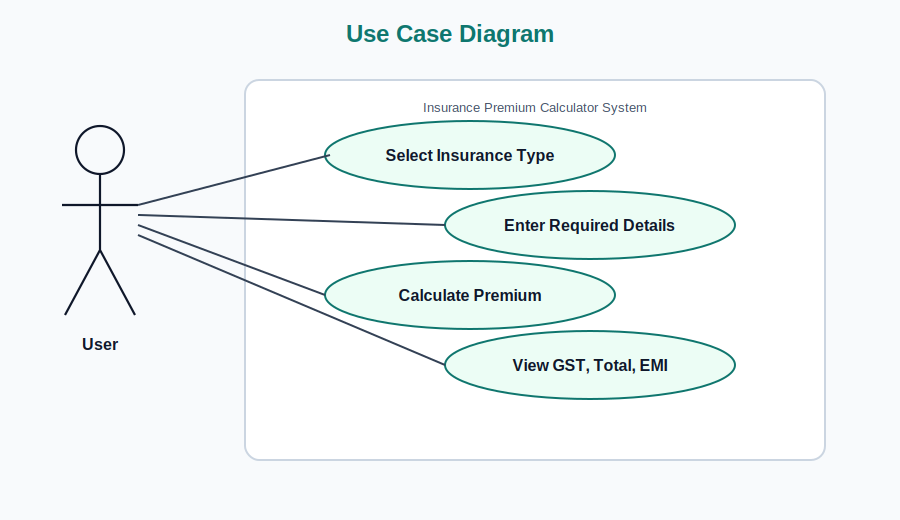
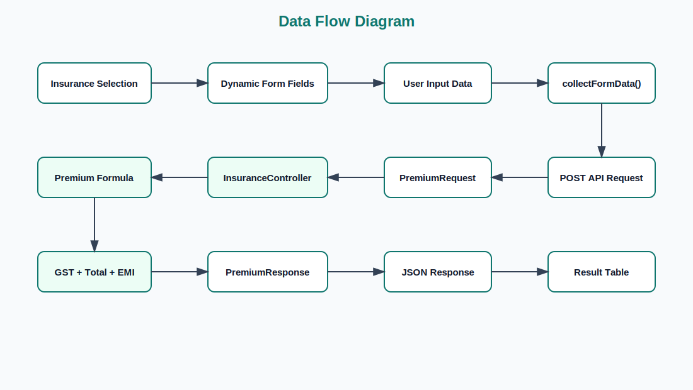
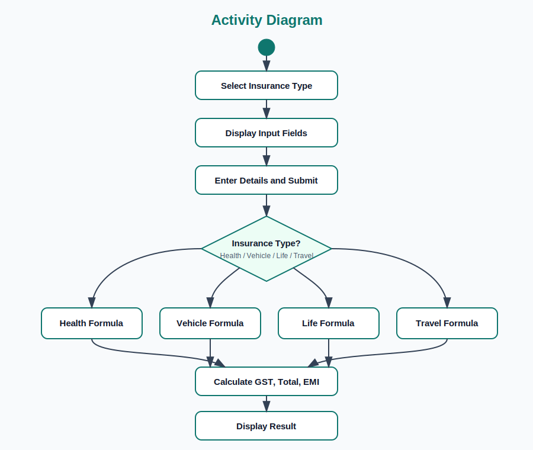
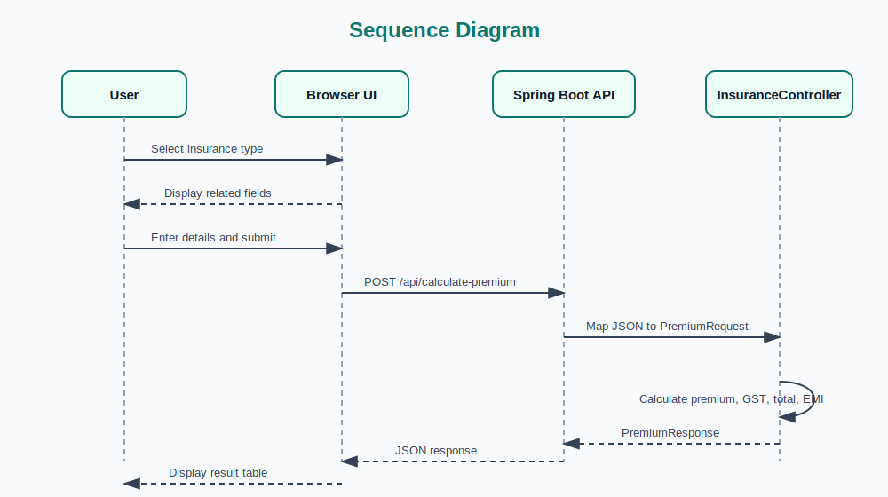

# Insurance Premium Calculator Project Report

## Abstract

The Insurance Premium Calculator is a web-based application developed to estimate insurance premiums for different policy categories, including health, vehicle, life, and travel insurance. The system provides a simple user interface where users select an insurance type, enter relevant details, and receive calculated premium information. The application calculates the base premium, Goods and Services Tax (GST), total payable amount, and Equal Monthly Installment (EMI) options for 3, 6, 9, and 12 months.

The project is implemented using Spring Boot for the backend REST API and HTML, CSS, and JavaScript for the frontend. The backend receives user input through a JSON request, applies predefined premium calculation rules, and returns a structured response. The frontend dynamically displays form fields based on the selected insurance type and presents the result in a clear tabular format. This project demonstrates the use of client-server communication, REST API design, form handling, conditional business logic, and basic financial computation.

## Introduction

Insurance is an important financial service that helps individuals manage risk by providing protection against uncertain events such as illness, accidents, loss of life, vehicle damage, and travel-related issues. In many cases, customers need an estimated premium before choosing a policy. Manual premium estimation can be time-consuming and may require repeated calculations based on age, coverage amount, vehicle value, policy term, trip cost, and other factors.

The Insurance Premium Calculator project addresses this need by providing a simple digital tool for estimating premium amounts. The application allows users to choose from four insurance categories:

- Health Insurance
- Vehicle Insurance
- Life Insurance
- Travel Insurance

Each insurance category requires different input values. For example, health insurance uses age, coverage amount, and number of family members, while vehicle insurance uses vehicle type, vehicle value, and vehicle age. The application processes these inputs using fixed calculation rules and displays premium details immediately.

The system is designed as a lightweight web application. The frontend is served as a static HTML page, while the backend is implemented using Java and Spring Boot. This structure separates user interaction from business logic and makes the application easier to maintain and extend.

## Literature Review

Insurance premium calculation systems are widely used in the insurance and financial technology sectors. Traditional premium calculation depends on actuarial models, risk assessment, customer profile analysis, claim history, demographic data, and regulatory requirements. Large-scale insurance platforms often use advanced statistical models and machine learning techniques to evaluate risk more accurately. However, for academic and prototype systems, rule-based premium calculation is commonly used because it is easy to understand, implement, and test.

Web-based financial calculators are popular because they provide instant results and improve user convenience. A typical calculator application includes a user interface, input validation, business logic, and result display. Modern web applications commonly use REST APIs to exchange data between the frontend and backend. REST architecture is suitable for this project because the frontend submits user details to an API endpoint and receives calculated premium results in JSON format.

Spring Boot is widely used for building Java-based web applications because it simplifies application configuration, dependency management, and REST API development. Java is also suitable for this project because it provides strong typing, object-oriented programming support, and reliable backend execution. On the frontend, HTML, CSS, and JavaScript provide a simple and browser-compatible way to build interactive forms and display dynamic results.

This project follows a rule-based approach rather than a real actuarial pricing model. The objective is not to produce legally accurate commercial insurance quotes, but to demonstrate how an insurance premium estimation system can be designed and implemented using web technologies.

## Objectives

The main objectives of this project are:

- To develop a web-based insurance premium calculator.
- To support premium estimation for health, vehicle, life, and travel insurance.
- To create a simple and user-friendly interface for selecting insurance type and entering details.
- To dynamically display input fields based on the selected insurance category.
- To calculate premium amount using predefined business rules.
- To calculate GST at 18% on the premium amount.
- To calculate the total payable amount after adding GST.
- To provide EMI options for 3, 6, 9, and 12 months.
- To implement backend processing using Spring Boot REST API.
- To demonstrate client-server communication using JavaScript Fetch API and JSON.

## Methodology

The project follows a simple client-server methodology. The frontend collects user input, sends the data to the backend API, and displays the response received from the server.

## Graphical Diagrams

### System Architecture Diagram

### Use Case Diagram

### Data Flow Diagram

### Activity Diagram

### Sequence Diagram

### 1. Requirement Analysis

The first step is to identify the major functions required in the system. The application should allow users to:

- Select an insurance type.
- Enter required information for the selected insurance type.
- Submit the form.
- View premium amount, GST, total amount, and EMI options.

### 2. System Design

The application is divided into two major parts:

- Frontend: A static web page developed using HTML, CSS, and JavaScript.
- Backend: A Spring Boot REST API developed using Java.

The frontend file is located at:

`src/main/resources/static/index.html`

The backend controller is located at:

`src/main/java/com/calculate/insurance/insurancecalculator/controller/InsuranceController.java`

### 3. Frontend Development

The frontend provides insurance selection cards for health, vehicle, life, and travel insurance. When the user selects an insurance type, JavaScript dynamically generates the required form fields. The interface also includes icons to improve visual clarity and usability.

When the user submits the form, JavaScript collects the form data and sends a POST request to:

`/api/calculate-premium`

The request body is sent in JSON format.

### 4. Backend Development

The backend uses Spring Boot and exposes a REST endpoint:

`POST /api/calculate-premium`

The API accepts a `PremiumRequest` object and returns a `PremiumResponse` object. The request model contains input fields such as insurance type, age, coverage amount, vehicle value, vehicle age, trip cost, travel days, and number of travellers.

The response model contains:

- Insurance type
- Premium amount
- GST amount
- Total amount
- EMI options

### 5. Premium Calculation Logic

The system uses predefined formulas for different insurance types.

Health insurance:

`Premium = Coverage Amount * 0.02 + Number of Members * 1000`

If age is greater than 45, an additional amount of `2000` is added.

Vehicle insurance:

For car:

`Premium = Vehicle Value * 0.03`

For bike:

`Premium = Vehicle Value * 0.02`

An additional amount is added based on vehicle age:

`Vehicle Age * 500`

Life insurance:

`Premium = Coverage Amount * 0.015 + Policy Term * 300`

If age is greater than 40, an additional amount of `1500` is added.

Travel insurance:

`Premium = Trip Cost * 0.01 + Travel Days * 50 + Travellers * 300`

After calculating the premium, GST is calculated as:

`GST = Premium * 0.18`

Total amount is calculated as:

`Total Amount = Premium + GST`

EMI options are calculated by dividing the total amount by 3, 6, 9, and 12 months.

### 6. Testing

The application is tested by running the Maven test command:

`./mvnw test`

The available Spring Boot application test verifies that the application context loads successfully.

## Expected Result

The expected result of this project is a working web application that allows users to estimate insurance premiums quickly and clearly. Users should be able to:

- Open the insurance calculator in a browser.
- Select one of the available insurance types.
- Enter the required details for the selected insurance type.
- Submit the form to calculate the premium.
- View the base premium, GST amount, total amount, and EMI options.

The system is expected to improve the ease of premium estimation by reducing manual calculation. It should also provide a clean and interactive interface with icons, structured input fields, and tabular result presentation.

Since the calculation rules are fixed and simplified, the result should be treated as an estimated academic calculation rather than an official insurance quote.

## Work Plan

| Phase | Task | Description |
| --- | --- | --- |
| Phase 1 | Requirement Study | Identify required insurance types, input fields, and expected outputs. |
| Phase 2 | System Design | Plan frontend page, backend API, request model, and response model. |
| Phase 3 | Frontend Development | Create insurance selection UI, dynamic forms, styling, icons, and result table. |
| Phase 4 | Backend Development | Implement Spring Boot application, REST controller, and premium calculation logic. |
| Phase 5 | Integration | Connect frontend form submission with backend API using Fetch API. |
| Phase 6 | Testing | Test form inputs, API response, calculation output, and application startup. |
| Phase 7 | Documentation | Prepare project report with objectives, methodology, expected result, and references. |
| Phase 8 | Future Enhancement | Add database storage, user login, validation, admin module, and more accurate pricing models. |

## References

1. Spring. "Spring Boot Documentation." Available at: https://docs.spring.io/spring-boot/documentation.html
2. Oracle. "JDK 17 Documentation." Available at: https://docs.oracle.com/en/java/javase/17/
3. MDN Web Docs. "Fetch API." Available at: https://developer.mozilla.org/en-US/docs/Web/API/Fetch_API
4. MDN Web Docs. "HTML: HyperText Markup Language." Available at: https://developer.mozilla.org/en-US/docs/Web/HTML
5. MDN Web Docs. "CSS: Cascading Style Sheets." Available at: https://developer.mozilla.org/en-US/docs/Web/CSS
6. Project source code: `InsuranceCalculator` Spring Boot application.
